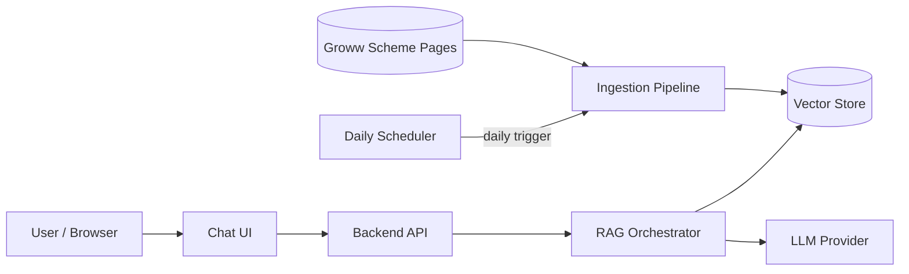
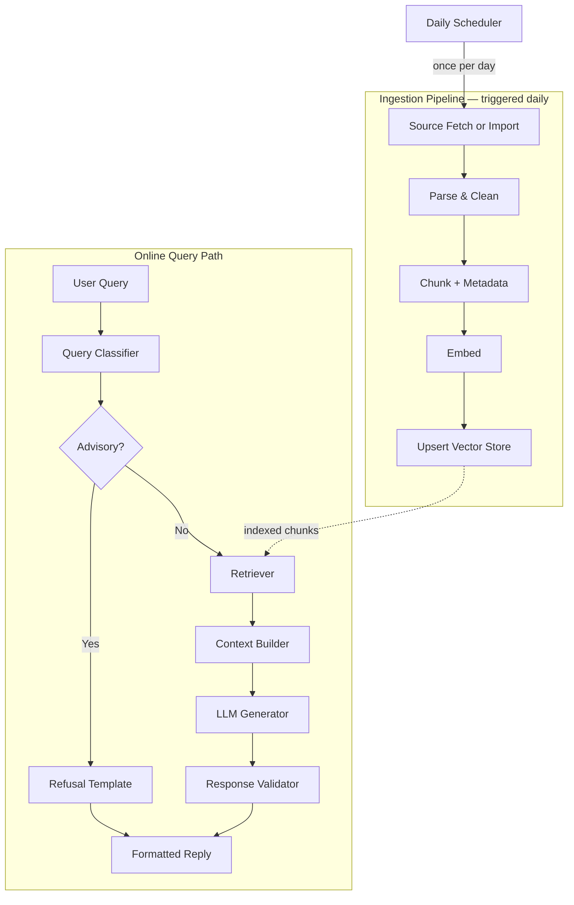
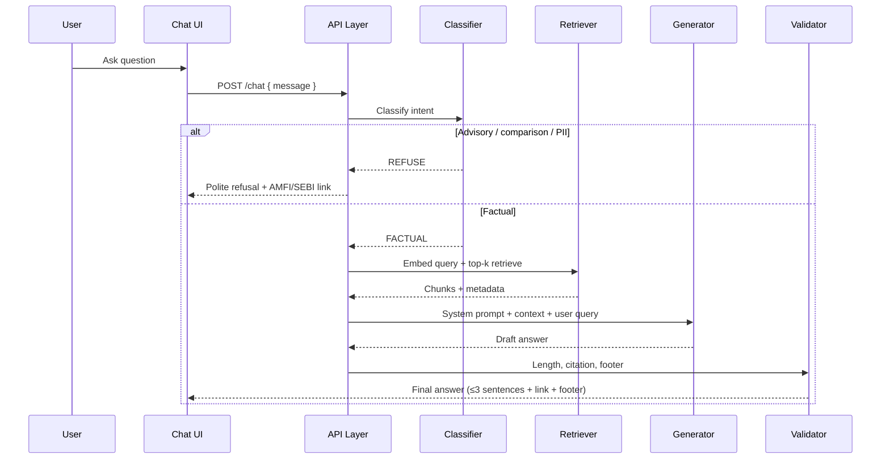
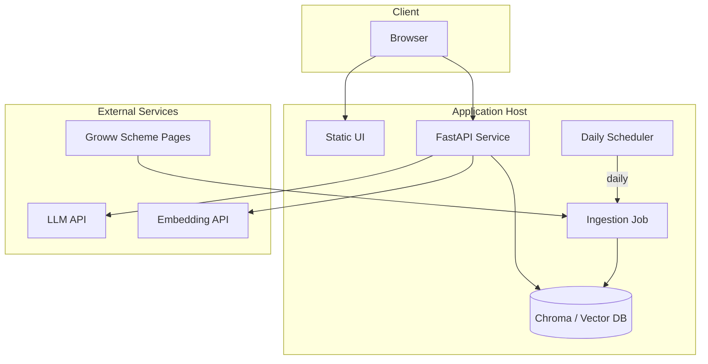

# Architecture: Mutual Fund FAQ Assistant (Facts-Only RAG)

This document describes the technical architecture for the **HDFC Mutual Fund FAQ Assistant** defined in [problemStatement.md](./problemStatement.md). The system is a lightweight **Retrieval-Augmented Generation (RAG)** pipeline that answers **facts-only** questions from a fixed corpus of **five Groww scheme pages**, with strict compliance guardrails and source-backed responses.

---

## 1. Design Principles

| Principle | Implication |
|-----------|-------------|
| **Accuracy over intelligence** | Prefer retrieved facts over model creativity; low temperature at generation |
| **Source-backed answers** | Every factual answer cites exactly one corpus URL |
| **Bounded corpus** | No open-web search; retrieval limited to indexed content from the 5 URLs |
| **Compliance by design** | Advisory queries blocked before or during generation; no PII collection |
| **Transparency** | Short answers (≤3 sentences), visible disclaimer, `Last updated from sources` footer |

---

## 2. System Context



**External actors**

- **End users:** Retail investors or internal support staff asking factual scheme questions
- **Corpus sources:** Five public Groww pages (HDFC schemes); refreshed by a **daily scheduler** that runs the ingestion pipeline—not fetched live on each user query
- **Educational links (refusal only):** AMFI / SEBI URLs for advisory refusals—not part of the RAG retrieval index

---

## 3. High-Level Architecture

The system splits into four layers:

1. **Ingestion & indexing** — Daily scheduled fetch of scheme pages, normalize, chunk, embed, persist (plus optional manual reindex)
2. **Retrieval & reasoning** — Classify query, retrieve relevant chunks, assemble context
3. **Generation & post-processing** — LLM answer with constraints; validate citations and length
4. **Presentation** — Minimal chat UI with disclaimer and example prompts



---

## 4. Corpus & Data Model

### 4.1 Source documents

Each of the five schemes maps to one **source document** with a stable `source_url`:

| `scheme_id` | Scheme name | `source_url` |
|-------------|-------------|--------------|
| `hdfc-silver-etf-fof` | HDFC Silver ETF FoF Direct Growth | https://groww.in/mutual-funds/hdfc-silver-etf-fof-direct-growth |
| `hdfc-mid-cap` | HDFC Mid Cap Fund Direct Growth | https://groww.in/mutual-funds/hdfc-mid-cap-fund-direct-growth |
| `hdfc-equity` | HDFC Equity Fund Direct Growth | https://groww.in/mutual-funds/hdfc-equity-fund-direct-growth |
| `hdfc-gold-etf-fof` | HDFC Gold ETF Fund of Fund Direct Plan Growth | https://groww.in/mutual-funds/hdfc-gold-etf-fund-of-fund-direct-plan-growth |
| `hdfc-nifty-50-index` | HDFC NIFTY 50 Index Fund Direct Growth | https://groww.in/mutual-funds/hdfc-nifty-50-index-fund-direct-growth |

### 4.2 Document metadata (per chunk)

Every chunk stored in the vector index should carry:

| Field | Purpose |
|-------|---------|
| `chunk_id` | Unique identifier |
| `scheme_id` | Filter retrieval to the correct fund |
| `scheme_name` | Human-readable scheme label |
| `source_url` | Citation link returned to the user |
| `section` | Logical block: `overview`, `costs`, `exit_load`, `tax`, `minimum_investment`, `risk`, `benchmark`, `fund_management`, `objective`, `fund_house`, etc. |
| `content` | Plain text used for embedding and LLM context |
| `last_updated` | Date derived from ingestion (e.g., NAV date or ingest timestamp) |

### 4.3 Supported fact domains

Retrieval and answers must cover (when present in corpus):

- Expense ratio, exit load, stamp duty, tax implications
- Minimum SIP / lumpsum amounts
- Riskometer / risk label
- Benchmark and investment objective
- **Fund management:** manager name(s), tenure, education, experience, other schemes managed
- Fund house contact (AMC website link from page—cite the **scheme** Groww URL unless answering AMC-wide FAQ)

**Out of scope for generated comparisons:** return rankings, “which fund is better,” performance calculations, manager quality opinions.

---

## 5. Ingestion Pipeline

### 5.0 Daily ingestion scheduler

**Phase 7** implements the pipeline (`ingestion/run_daily.py`); **Phase 8** wires the external scheduler (`scripts/reindex.sh`, `scheduler/cron.example`). See [implementation-plan.md](./implementation-plan.md).

A **scheduler** runs the full ingestion pipeline **once per day** so the vector index and `last_updated` metadata stay aligned with the five Groww scheme pages.

| Aspect | Design |
|--------|--------|
| **Trigger** | Cron expression or platform scheduler (e.g., `0 2 * * *` — 02:00 daily) |
| **Job entrypoint** | Single orchestrator script (e.g., `ingestion/run_daily.py` or `scripts/reindex.sh`) |
| **Steps executed** | Fetch → parse → chunk → embed → upsert vector store |
| **Concurrency** | One ingestion run at a time; skip or queue if previous run still in progress |
| **Failure handling** | Log error, alert on failure; **retain previous index** until next successful run |
| **Runtime coupling** | Chat API reads only from the vector store; it does **not** invoke ingestion on user requests |

**Scheduler implementation options:**

| Option | Use when |
|--------|----------|
| **OS cron** / **systemd timer** | VM or bare-metal deployment |
| **Kubernetes CronJob** | Container orchestration |
| **GitHub Actions scheduled workflow** | Lightweight cloud cron without a always-on host |
| **APScheduler** (embedded) | Single-process demo; scheduler thread inside app process |

Production recommendation: **external cron** (OS, K8s, or CI scheduler) invoking the ingestion script, keeping batch work separate from the API process.

### 5.1 Acquisition

| Mode | Description |
|------|-------------|
| **Fetch (primary)** | Daily HTTP fetch of all five Groww URLs via the scheduler, with respectful rate limits and caching |
| **Import (fallback)** | Pre-saved markdown/HTML per scheme (e.g., `uploads/*.md`) for local dev or when fetch fails |

Raw pages contain navigation boilerplate; ingestion must **strip** menus, footers, calculators, and cross-promotional blocks visible in scraped markdown.

### 5.2 Parsing & sectioning

1. Detect `Source URL` / scheme title from document header
2. Map content into **semantic sections** using headings and keywords:
   - `### Fund management` → `fund_management` chunks (one chunk per manager block if needed)
   - Exit load / tax tables → dedicated chunks
   - “Minimum investments” → `minimum_investment`
3. Attach `scheme_id` and `source_url` to every section

### 5.3 Chunking strategy

Built in **Phase 1** (`ingestion/chunk.py`, `data/chunks/`). Phase 2 indexes the pre-built store without re-chunking. Full rules: [implementation-plan.md § Phase 1](./implementation-plan.md#phase-1--corpus-parsing-sectioning--chunking).

| Section type | Chunking rule |
|--------------|---------------|
| `costs`, `exit_load`, `tax`, `minimum_investment`, `risk`, `benchmark` | One chunk per section per scheme |
| `fund_management` | One chunk per `Fund manager:` block (name, tenure, education, experience, also manages together) |
| `objective` | One chunk; split by paragraph only if > ~2,400 chars (~500–800 tokens), 300-char overlap |
| Dedupe | Drop identical embedding `text` at chunk build (RT-05) |

**Prefix template for embeddings:**

```text
Scheme: {scheme_name} | Section: {section} | {content}
```

### 5.4 Embedding & index

Built in **Phase 2** (`ingestion/embed.py`, `ingestion/index.py`). Full provider rules: [implementation-plan.md § Phase 2](./implementation-plan.md#phase-2--embedding--vector-index).

- **Embedding model (default):** Local **BGE** (`BAAI/bge-small-en-v1.5`) via `sentence-transformers` — free, no API key. Optional: `BAAI/bge-large-en-v1.5` or paid `text-embedding-3-small`
- **Vector store:** **ChromaDB** (persistent, `vector_store/`) — collection `hdfc_groww_corpus`; metadata filters for `scheme_id`, `section`, `source_url`
- **Index input:** Pre-built chunks from `data/chunks/` (Phase 1); `embed_texts` for passages, `embed_query` for retrieval (BGE query prefix)
- **Re-ingest:** Version corpus by `ingested_at`; rebuild index on each **daily** scheduler run (Phase 8 cron → Phase 7 `run_daily.py`)

---

## 6. Query Path (Runtime)

### 6.1 Request flow



### 6.2 Query classification

Run **before** retrieval to save cost and enforce policy:

| Class | Examples | Action |
|-------|----------|--------|
| `ADVISORY` | “Should I invest?”, “Which fund is better?”, “Is this manager best for me?” | Refusal template |
| `PERFORMANCE_COMPARE` | “Compare returns of gold vs silver fund” | Refusal or factsheet-only link per policy |
| `PII` | PAN, phone, account numbers | Hard refuse; do not log payload |
| `OUT_OF_CORPUS` | Schemes not in the five URLs | Clarify supported schemes list |
| `FACTUAL` | Expense ratio, exit load, fund manager tenure | Full RAG path |

Implementation options:

- **Rules + keywords** (fast, deterministic)
- **LLM classifier** with JSON output (backup for edge cases)
- Hybrid: rules first, LLM only if uncertain

### 6.3 Retrieval

| Parameter | Recommended value |
|-----------|-------------------|
| `top_k` | 4–6 chunks |
| Similarity threshold | Drop chunks below threshold; if none pass, return “not found in corpus” |
| **Scheme filter** | If user names a scheme (or alias), filter `scheme_id` before vector search |
| **Section boost** | Optional keyword boost for `fund_management` when query mentions “manager”, “who manages” |

**Multi-scheme queries** (e.g., “minimum SIP for all five funds”): retrieve per scheme or use a structured aggregation step that still emits **one** citation (prefer the most relevant single URL or ask user to specify scheme—product decision: default to first scheme mentioned).

### 6.4 Generation (LLM)

**System prompt constraints (non-negotiable):**

1. Answer only from provided context; if missing, say information is not in the corpus
2. Maximum **3 sentences**
3. Include **exactly one** markdown link using `source_url` from the best-matching chunk
4. Append footer: `Last updated from sources: {last_updated}`
5. No investment advice, rankings, or return calculations
6. Fund management: biographical facts only—no opinions on manager skill

**Context assembly:**

```text
[CONTEXT]
{chunk_1: scheme, section, content, source_url, last_updated}
...
[/CONTEXT]

[USER QUESTION]
{query}
```

**Model settings:** Low temperature (0–0.3), moderate max tokens (~200).

### 6.5 Response validation

Post-generation checks; regenerate or use template fallback if validation fails:

| Check | Rule |
|-------|------|
| Sentence count | ≤ 3 sentences |
| Citation | Exactly one URL; must be one of the five `source_url` values |
| Footer | Contains `Last updated from sources:` |
| Advisory leakage | Block “you should buy”, “better fund”, “recommend” |
| Performance | No computed returns unless quoting verbatim from context |

---

## 7. Refusal & Compliance Layer

### 7.1 Refusal response structure

1. Polite acknowledgment
2. Facts-only limitation statement
3. One educational link (AMFI investor education or SEBI investor page—configured constants, not retrieved)

### 7.2 Privacy

- **No** persistence of PAN, Aadhaar, account numbers, OTP, email, or phone
- Session chat history: optional, in-memory only or disabled for demo
- Logs: query text only; redact PII patterns if detected

### 7.3 Performance-related questions

Per problem statement: do not compute or compare returns. Response pattern:

- Brief facts-only line that performance comparisons are not provided
- Single link to the relevant scheme page (or AMC factsheet URL if present in chunk metadata)

---

## 8. API & Application Layer

### 8.1 Suggested endpoints

| Method | Path | Description |
|--------|------|-------------|
| `POST` | `/api/chat` | `{ "message": string }` → `{ "answer", "citation_url", "footer", "type": "answer" \| "refusal" }` |
| `GET` | `/api/schemes` | List supported schemes and URLs |
| `GET` | `/api/health` | Liveness + index version |
| `POST` | `/api/admin/reindex` | Protected; manual on-demand ingestion (dev/staging); production refresh is via **daily scheduler** |

### 8.2 Chat UI (minimal)

| Element | Requirement |
|---------|-------------|
| Welcome message | Explain facts-only HDFC scheme assistant |
| Example questions | 3 chips (e.g., expense ratio, exit load, fund manager) |
| Disclaimer | Persistent: **“Facts-only. No investment advice.”** |
| Message list | User query + assistant reply with clickable citation |
| Error state | Corpus miss / timeout messaging |

---

## 9. Proposed Repository Layout

```text
MUTUAL-FUND-RAG-CHATBOT/
├── docs/
│   ├── problemStatement.md
│   └── architecture.md          # this document
├── data/
│   ├── raw/                     # fetched .html, .json, .md per scheme
│   ├── corpus/                  # parsed sections (.json, .md, .html)
│   └── chunks/                  # Phase 1 chunk store + all_chunks.json
├── ingestion/
│   ├── fetch.py                 # fetch five Groww URLs
│   ├── parse.py                 # section extraction
│   ├── chunk.py                 # Phase 1 chunking + prefix template
│   ├── chunk_store.py           # persist data/chunks/
│   ├── index.py                 # Phase 2 embed + upsert
│   └── run_daily.py             # end-to-end job invoked by scheduler
├── scheduler/
│   └── cron.example             # sample crontab / K8s CronJob manifest
├── app/
│   ├── api/                     # FastAPI routes (Phase 5)
│   ├── main.py                  # FastAPI app entry
│   ├── rag/
│   │   ├── classifier.py
│   │   ├── retriever.py
│   │   ├── generator.py
│   │   ├── validator.py
│   │   └── backend.py           # RAG orchestrator (Phase 5)
│   └── config.py                # URLs, AMFI/SEBI links, model names
├── ui/                          # simple web chat (React/Vite or static HTML)
├── vector_store/                # local persistence (gitignored)
├── scripts/
│   └── reindex.sh               # wrapper called by daily cron
├── .env.example                 # API keys only; no secrets committed
└── README.md
```

---

## 10. Technology Options

Stack is intentionally flexible; a typical lightweight stack:

| Layer | Option A | Option B |
|-------|----------|----------|
| Backend | Python + FastAPI | Node.js + Express |
| Vector DB | Chroma (local) | Pinecone (hosted) |
| Embeddings | OpenAI / Azure OpenAI | sentence-transformers (local) |
| LLM | Groq (`llama-3.3-70b-versatile`) | GPT-4o-mini / Claude Haiku |
| UI | React + Vite | Streamlit (fastest demo) |
| Ingestion | Python scripts (`run_daily.py`) | Notebook for one-off import |
| Scheduler | OS cron / K8s CronJob | GitHub Actions `schedule` |

**Recommendation for fellowship/demo:** Python FastAPI + Chroma + local BGE-small + Groq chat, static or React UI.

---

## 11. Configuration

Environment-driven settings (`.env`):

```bash
# LLM (Groq) & embeddings
GROQ_API_KEY=
CHAT_MODEL=llama-3.3-70b-versatile
OPENAI_API_KEY=
EMBEDDING_PROVIDER=local
EMBEDDING_MODEL=BAAI/bge-small-en-v1.5
EMBEDDING_AUTO_BGE=true

# Retrieval
TOP_K=5
SIMILARITY_THRESHOLD=0.7

# Compliance links (refusal only)
AMFI_EDUCATION_URL=https://www.amfiindia.com/investor/knowledge-center-info
SEBI_INVESTOR_URL=https://investor.sebi.gov.in/

# Corpus
CORPUS_VERSION=1
INGESTED_AT=2026-06-05

# Daily ingestion scheduler — 10:00 AM IST (set CRON_TZ or use scheduler/cron.example)
INGEST_CRON_SCHEDULE=0 10 * * *
INGEST_TIMEZONE=Asia/Kolkata
```

---

## 12. Example Question → Retrieval Mapping

| User question | Likely `section` | `scheme_id` resolution |
|---------------|------------------|------------------------|
| “What is the expense ratio of HDFC Mid Cap Fund?” | `costs` | `hdfc-mid-cap` |
| “Exit load on HDFC Gold ETF FoF?” | `exit_load` | `hdfc-gold-etf-fof` |
| “Who manages HDFC NIFTY 50 Index Fund?” | `fund_management` | `hdfc-nifty-50-index` |
| “Minimum SIP for silver fund?” | `minimum_investment` | `hdfc-silver-etf-fof` |
| “Should I invest in HDFC Equity Fund?” | — | `ADVISORY` → refusal |

---

## 13. Observability & Quality

| Metric | Purpose |
|--------|---------|
| Retrieval hit rate | % queries with chunks above threshold |
| Refusal rate | Advisory vs factual mix |
| Validation failure rate | Citations / length post-checks |
| Latency p95 | Embed + retrieve + generate |
| Daily ingest success | Last run status, duration, chunks indexed, `ingested_at` |
| Manual eval set | 20–30 golden Q&A pairs across five schemes + fund management |

**Golden tests** should assert:

- Correct `source_url` in citation
- ≤ 3 sentences
- Footer present
- Advisory questions never produce buy/hold language

---

## 14. Known Limitations

| Limitation | Mitigation |
|------------|------------|
| Corpus fixed to 5 Groww pages | Document supported schemes; refuse unknown funds |
| Groww content can change | **Daily scheduler** re-ingest; surface `last_updated` from last successful run |
| Scraped noise (nav, calculators) | Aggressive parsing in ingestion |
| Scheme disambiguation | Alias map (“silver fund” → `hdfc-silver-etf-fof`) |
| Multi-scheme answers | May need user clarification or multiple turns |
| No live NAV guarantee | State that figures are as of last ingest |
| Groww is reference UI, not regulatory source | Citations use Groww URLs per project scope; AMFI/SEBI only for education on refusal |

---

## 15. Security Summary

- API keys in environment variables only
- No PII fields in API contract
- Admin reindex endpoint authenticated or disabled in production
- CORS restricted to UI origin in deployment
- Rate limiting on `/api/chat` to prevent abuse

---

## 16. Deployment View



**Minimal deployment:** Single container or VM with UI + API + local vector store; configure a **daily cron** (or K8s CronJob) on the same host to run `ingestion/run_daily.py` / `scripts/reindex.sh`. The API process stays separate from the scheduled job.

---

## 17. Alignment with Problem Statement

| Requirement | Architectural component |
|-------------|-------------------------|
| 5 Groww URLs only | Fixed corpus config + citation validator |
| Fund management answers | `fund_management` sections + retrieval boost |
| ≤ 3 sentences, 1 link, footer | Generator prompt + `validator.py` |
| Advisory refusal | `classifier.py` + refusal templates |
| No PII | API schema + log redaction |
| Minimal UI | `ui/` welcome, 3 examples, disclaimer |
| Facts-only | Low temperature, context-only generation, no open web |
| Fresh corpus | Daily scheduler + ingestion pipeline (§5.0) |

---

## 18. Implementation Phases

Eleven phases, **Phase 0–10** (see [implementation-plan.md](./implementation-plan.md)):

| Phase | Deliverable |
|-------|-------------|
| **0** | Project bootstrap & scheme config |
| **1** | Parse & section corpus (5 schemes) |
| **2** | Chunk, embed, index + smoke tests |
| **3** | Query classifier & compliance refusals |
| **4** | Retriever & context assembly |
| **5** | Generator, validator, `/api/chat` |
| **6** | Minimal chat UI |
| **7** | `run_daily.py`, atomic index swap, ingest observability |
| **8** | Daily scheduler (`reindex.sh`, cron.example) |
| **9** | Golden tests, prod hardening (rate limit, CORS) |
| **10** | README, deployment guide, disclaimer, final demo |

---

## 19. References

- [problemStatement.md](./problemStatement.md) — product scope, corpus URLs, compliance rules
- Groww scheme pages (corpus): see §4.1 in this document or problem statement §1
