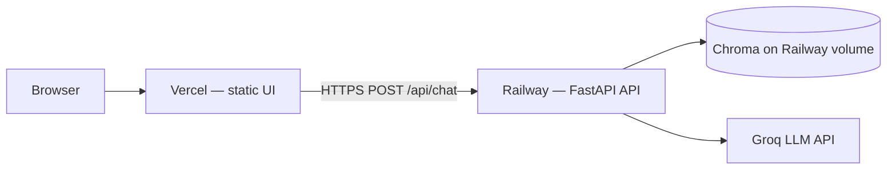

# Deployment Plan — Railway (Backend) + Vercel (Frontend)

Step-by-step guide to deploy the **HDFC Mutual Fund FAQ Assistant** with:

| Layer | Platform | What runs there |
|-------|----------|-----------------|
| **Backend** | [Railway](https://railway.app) | FastAPI API, Chroma vector store, RAG pipeline |
| **Frontend** | [Vercel](https://vercel.com) | Static chat UI (`ui/`) |

**References:** [architecture.md](./architecture.md) · [implementation-plan.md § Phase 10](./implementation-plan.md#phase-10--documentation--deployment) · [README.md](../README.md)

---

## 1. Target architecture

Locally, FastAPI serves both the API and `ui/` from one process. In production we **split** them:



| Endpoint (Railway) | Purpose |
|--------------------|---------|
| `POST /api/chat` | RAG chat |
| `GET /api/health` | Index readiness |
| `GET /api/schemes` | Five curated schemes |

The UI in `ui/app.js` calls the API via `window.__API_BASE__`. When empty, requests are same-origin (local dev). On Vercel you **must** set this to your Railway public URL.

---

## 2. Prerequisites

Before deploying, confirm:

- [ ] GitHub repo is pushed (Railway and Vercel connect via Git).
- [ ] Local tests pass: `python -m pytest -v`
- [ ] Vector index builds locally: `python scripts/build_index.py --reset`
- [ ] Accounts on [Railway](https://railway.app) and [Vercel](https://vercel.com).
- [ ] **Groq API key** ([console.groq.com](https://console.groq.com)) for LLM answers in production.
- [ ] (Optional) **OpenAI API key** if you prefer paid cloud embeddings instead of local BGE on Railway.

### Repo artifacts used in deploy

| Path | Role |
|------|------|
| `app/` | FastAPI + RAG backend |
| `ingestion/` | Index build & daily ingest |
| `data/chunks/` | Committed chunk store (bootstrap index without Groww fetch) |
| `ui/` | Static frontend for Vercel |
| `requirements.txt` | Python dependencies |
| `vector_store/` | Chroma persistence (**gitignored** — created on Railway) |

---

## 3. Pre-deployment checklist

Run once on your machine from the repo root:

```powershell
cd MUTUAL-FUND-RAG-CHATBOT
python -m venv .venv
.venv\Scripts\pip install -r requirements.txt
copy .env.example .env
# Add GROQ_API_KEY to .env
python scripts/build_index.py --reset
python -m pytest -v
```

Verify the API locally:

```powershell
uvicorn app.main:app --host 127.0.0.1 --port 8000
# GET http://127.0.0.1:8000/api/health  → index_ready: true
```

Commit and push all application code. Do **not** commit `.env` or `vector_store/`.

---

## 4. Deploy backend on Railway

### 4.1 Create the service

1. Log in to Railway → **New Project** → **Deploy from GitHub repo**.
2. Select this repository.
3. Railway auto-detects Python. Confirm:
   - **Root directory:** `/` (repo root)
   - **Builder:** Nixpacks (default)

### 4.2 Start command

In **Settings → Deploy → Start Command**, set:

```bash
uvicorn app.main:app --host 0.0.0.0 --port $PORT
```

Railway injects `$PORT`; do not hard-code `8000`.

### 4.3 Persistent volume for Chroma

The vector index must survive redeploys.

1. In the Railway service → **Volumes** → **Add Volume**.
2. Mount path: `/app/vector_store` (or match `VECTOR_STORE_PATH` below).
3. Set env var: `VECTOR_STORE_PATH=/app/vector_store`.

Without a volume, every redeploy starts with an empty index until you rebuild it.

### 4.4 Railway environment variables

Set these in **Variables** (never commit secrets):

| Variable | Production value | Notes |
|----------|------------------|-------|
| `APP_ENV` | `production` | Enables prod rate limits & CORS rules |
| `GROQ_API_KEY` | `gsk_...` | Required for Groq LLM answers |
| `CHAT_MODEL` | `llama-3.3-70b-versatile` | Default; change if needed |
| `VECTOR_STORE_PATH` | `/app/vector_store` | Must match volume mount |
| `CORS_ORIGINS` | `https://your-app.vercel.app` | Your Vercel URL(s), comma-separated |
| `CHAT_RATE_LIMIT_PER_MINUTE` | `30` | Optional; prod defaults to 30 when `APP_ENV=production` |
| `ADMIN_REINDEX_ENABLED` | `false` | Disable admin reindex in public prod |
| `EMBEDDING_PROVIDER` | `local` or `openai` | See §4.6 |
| `EMBEDDING_BACKEND` | `fastembed` | ONNX runtime (~80MB RAM); required on free tier |
| `EMBEDDING_MODEL` | `BAAI/bge-small-en-v1.5` | For local BGE |
| `SERVE_UI` | `false` | UI is on Vercel |
| `PRELOAD_EMBEDDING_MODEL` | `false` | Lazy-load embeddings on first chat |
| `INDEX_BATCH_SIZE` | `16` | Lower peak RAM during index builds |
| `OPENAI_API_KEY` | (if using OpenAI embeddings) | Only when `EMBEDDING_PROVIDER=openai` |
| `TOP_K` | `5` | Retrieval default |
| `SIMILARITY_THRESHOLD` | `0.7` | OpenAI embeddings; BGE uses lower internal thresholds |
| `CORPUS_VERSION` | `1` | Metadata |
| `INGEST_CRON_SCHEDULE` | `0 10 * * *` | For cron service (§6) |
| `INGEST_TIMEZONE` | `Asia/Kolkata` | IST |

**CORS example** (replace with your real Vercel domain):

```text
CORS_ORIGINS=https://hdfc-faq-assistant.vercel.app,https://hdfc-faq-assistant-username.vercel.app
```

Include both production and preview URLs if you test preview deployments.

### 4.5 Bootstrap the vector index (first deploy)

After the first successful deploy, the index is empty until you build it.

**Option A — Railway shell (recommended)**

1. Service → **Settings** → open a **one-off shell** / **Run command**.
2. Run:

```bash
pip install -r requirements.txt
python scripts/build_index.py --reset
```

This indexes committed `data/chunks/` (~45 chunks). No Groww fetch required.

**Option B — Admin reindex (dev/staging only)**

If you temporarily enable reindex for bootstrap:

```text
ADMIN_REINDEX_ENABLED=true
ADMIN_REINDEX_TOKEN=<long-random-secret>
```

Then:

```bash
curl -X POST "https://YOUR-RAILWAY-APP.up.railway.app/api/admin/reindex" \
  -H "X-Admin-Token: YOUR_SECRET"
```

Set `ADMIN_REINDEX_ENABLED=false` again after bootstrap.

### 4.6 Embeddings on Railway (important)

Default **local BGE** (`sentence-transformers`) works but:

- First run downloads ~130 MB model weights.
- Needs ~1–2 GB RAM during embed/index.
- Cold starts are slower.

| Provider | When to use | Env |
|----------|-------------|-----|
| **local** (BGE) | Hobby tier with enough RAM; index built once | `EMBEDDING_PROVIDER=local` |
| **openai** | Smaller Railway instance; faster index builds | `EMBEDDING_PROVIDER=openai`, `EMBEDDING_MODEL=text-embedding-3-small`, `OPENAI_API_KEY=...` |

Use the **same provider** for bootstrap and any later reindex, or rebuild the full index after switching.

### 4.7 Verify Railway

```bash
curl https://YOUR-RAILWAY-APP.up.railway.app/api/health
```

Expect:

```json
{
  "status": "ok",
  "index_ready": true,
  "index_chunk_count": 40
}
```

Smoke chat:

```bash
curl -X POST "https://YOUR-RAILWAY-APP.up.railway.app/api/chat" \
  -H "Content-Type: application/json" \
  -d "{\"message\": \"What is the expense ratio of HDFC Mid Cap Fund?\"}"
```

Copy the Railway public URL — you need it for Vercel and `CORS_ORIGINS`.

---

## 5. Deploy frontend on Vercel

The UI is a **static site** in `ui/` (HTML, CSS, JS). No Node build is required unless you inject config at build time.

### 5.1 Point the UI at Railway

`ui/app.js` reads:

```javascript
const API_BASE = window.__API_BASE__ || "";
```

For Vercel, expose the Railway URL **before** `app.js` loads.

#### Step 1 — Add `ui/config.js`

Create `ui/config.js` (replace with your Railway URL):

```javascript
window.__API_BASE__ = "https://YOUR-RAILWAY-APP.up.railway.app";
```

#### Step 2 — Load it in `ui/index.html`

Add this line **above** the existing `app.js` script tag:

```html
<script src="/config.js"></script>
<script src="/app.js" type="module"></script>
```

Commit `config.js` with the production URL, or generate it in a Vercel build step (§5.4).

### 5.2 Create the Vercel project

1. Log in to Vercel → **Add New** → **Project** → import the same GitHub repo.
2. **Framework Preset:** Other (static).
3. **Root Directory:** `ui` ← important.
4. **Build Command:** leave empty (or see §5.4).
5. **Output Directory:** `.` (current directory, since root is already `ui`).

Deploy. Your app will be at `https://<project>.vercel.app`.

### 5.3 Update Railway CORS

After you know the Vercel URL, update Railway:

```text
CORS_ORIGINS=https://<project>.vercel.app
```

Redeploy or restart the Railway service if needed. Without this, browser requests from Vercel will be blocked by CORS.

### 5.4 (Optional) Vercel env-based config

To avoid committing the Railway URL, use a tiny build script.

**`ui/package.json`** (already in repo) runs `ui/scripts/build-config.js`, which writes `config.js` from `VITE_API_BASE_URL`.

In Vercel:

| Setting | Value |
|---------|-------|
| Root Directory | `ui` |
| Build Command | `npm run build` |
| Output Directory | `.` |
| Environment variable | `VITE_API_BASE_URL` = `https://YOUR-RAILWAY-APP.up.railway.app` |

Ensure `index.html` loads `/config.js` before `/app.js`.

### 5.5 Verify Vercel

1. Open `https://<project>.vercel.app`.
2. Status pill should show **Index ready** (calls `/api/health` on Railway).
3. Send a factual question; confirm answer, citation link, and disclaimer.
4. Open browser DevTools → Network: `POST` to `https://YOUR-RAILWAY-APP.../api/chat` should return `200`.

---

## 6. Daily corpus refresh in production

The app expects a **daily ingest** (10:00 AM IST). See [scheduler/README.md](../scheduler/README.md).

| Approach | Best for | How |
|----------|----------|-----|
| **Railway Cron** | Production API on Railway | Separate cron service or scheduled job running `python -m ingestion.run_daily` |
| **GitHub Actions** | Repo-centric refresh | [`.github/workflows/daily-ingest.yml`](../.github/workflows/daily-ingest.yml) — rebuilds index in CI, **does not** sync to Railway automatically |
| **Manual** | Demos / debugging | Railway shell: `python -m ingestion.run_daily` or `python scripts/build_index.py --reset` |

### Recommended: Railway cron job

1. Add a **Cron** service in the same Railway project (or use Railway’s cron trigger on a worker service).
2. Schedule: `0 10 * * *` with timezone `Asia/Kolkata`.
3. Command:

```bash
cd /app && python -m ingestion.run_daily
```

4. Share the same volume mount (`/app/vector_store`) and env vars as the API service.
5. Ensure the cron service has network egress for Groww fetch.

### Alternative: GitHub Actions + manual sync

The existing workflow rebuilds the index in CI. To use it with Railway you would need an extra step (e.g. trigger Railway admin reindex or upload artifacts). For simplicity, prefer **Railway cron** when the API lives on Railway.

---

## 7. Production hardening summary

| Control | Setting |
|---------|---------|
| Rate limiting | `APP_ENV=production` → 30 req/min per IP on `POST /api/chat` |
| CORS | `CORS_ORIGINS` = exact Vercel origin(s) only |
| Admin reindex | `ADMIN_REINDEX_ENABLED=false` in public prod |
| Secrets | `GROQ_API_KEY`, `OPENAI_API_KEY`, `ADMIN_REINDEX_TOKEN` only in platform env vars |
| HTTPS | Both Railway and Vercel provide TLS by default |

---

## 8. Post-deploy smoke test

| # | Test | Expected |
|---|------|----------|
| 1 | `GET /api/health` on Railway | `index_ready: true`, `index_chunk_count >= 40` |
| 2 | Vercel UI loads | Disclaimer, 3 example chips, scheme list |
| 3 | Factual question (×5 schemes) | Answer ≤3 sentences, one Groww citation |
| 4 | Advisory question | Refusal + AMFI/SEBI links |
| 5 | `GET /api/schemes` | 5 schemes returned |
| 6 | Rate limit (optional) | 31 rapid `POST /api/chat` → `429` |

---

## 9. Troubleshooting

| Symptom | Likely cause | Fix |
|---------|--------------|-----|
| UI shows **API offline** | Wrong `__API_BASE__` or Railway down | Check `ui/config.js` and Railway deploy logs |
| CORS error in browser console | `CORS_ORIGINS` missing Vercel URL | Add exact origin to Railway vars |
| **Index degraded** | Empty `vector_store` | Run `python scripts/build_index.py --reset` on Railway; confirm volume mount |
| `503` on `/api/chat` | Chroma missing or ingest in progress | Check `/api/health`; wait for ingest |
| Slow first request | BGE model loading | Normal for `EMBEDDING_PROVIDER=local`; consider OpenAI embeddings |
| OOM on Railway | BGE + Chroma RAM | Upgrade plan or switch to `EMBEDDING_PROVIDER=openai` |
| Template answers only | Missing `GROQ_API_KEY` | Set key in Railway variables |
| `429` rate limit | Prod default 30/min | Wait or adjust `CHAT_RATE_LIMIT_PER_MINUTE` |

**Logs**

- Railway: service → **Deployments** → **View logs**
- Vercel: project → **Deployments** → **Functions / Build logs** (static deploys mainly show build output)

---

## 10. Optional platform config files

Not required if you configure everything in the Railway/Vercel dashboards, but useful for reproducibility.

### `Procfile` / `railway.toml` / `nixpacks.toml` (repo root)

Already committed. `nixpacks.toml` sets `NIXPACKS_PYTHON_INSTALL_REQUIREMENTS=requirements-prod.txt` (no PyTorch) and runs **1 uvicorn worker**. Do not override Nixpacks install with a raw `pip install` command — that breaks the Python provider and causes `pip: command not found`.

Bootstrap index once in Railway shell:

```bash
python scripts/railway_bootstrap.py
```

### `ui/vercel.json` (static headers / SPA fallback)

```json
{
  "headers": [
    {
      "source": "/(.*)",
      "headers": [
        { "key": "X-Content-Type-Options", "value": "nosniff" },
        { "key": "Referrer-Policy", "value": "strict-origin-when-cross-origin" }
      ]
    }
  ]
}
```

---

## 11. Deployment order (quick reference)

```text
1. Push repo to GitHub
2. Deploy Railway API → set env vars → add volume → bootstrap index
3. Note Railway public URL
4. Add ui/config.js + script tag in index.html (or Vercel build env)
5. Deploy Vercel (root directory: ui)
6. Set CORS_ORIGINS on Railway to Vercel URL
7. Smoke test health + chat from Vercel UI
8. Configure Railway cron for daily ingest (optional but recommended)
```

---

## 12. Disclaimer

This assistant is **facts-only** and does not provide investment advice. The deployed UI must keep the visible disclaimer and compliance refusals intact. Corpus freshness depends on the daily ingest job configured in §6.

---

## 13. Railway free tier optimization

The repo is tuned for **512MB–1GB** Railway instances. See `.env.production.example`.

### Resource audit (what used the most RAM/storage)

| Consumer | Before | After | Savings |
|----------|--------|-------|---------|
| **sentence-transformers + PyTorch** | ~800MB–1.5GB RAM at runtime | **fastembed** (ONNX) ~80–150MB | **~85% RAM** |
| **Static UI on API** | Serves `ui/` from FastAPI | `SERVE_UI=false` (Vercel only) | Disk + minor RAM |
| **Full `requirements.txt` in image** | PyTorch, pytest, ST | `requirements-prod.txt` only | **~1.5GB disk** |
| **Deploy slug** | Whole repo | `.railwayignore` excludes `ui/`, `tests/`, `data/corpus/` | **Smaller upload** |
| **Chroma HNSW defaults** | High `M` / `ef` for large indexes | Tuned for 45 vectors | Lower RAM at query |
| **Index validation** | Loaded all chunk metadata | Samples ≤50 rows | Less spike RAM |
| **Chroma clients** | New client per request | Singleton cache | Fewer handles / RAM |
| **Embedding model at startup** | Loaded on import | Lazy load; `PRELOAD_EMBEDDING_MODEL=false` | Faster, leaner boot |
| **Index build batches** | 64 chunks/batch | `INDEX_BATCH_SIZE=16` | Lower peak RAM |
| **Duplicate chunk JSON** | `all_chunks.json` + per-scheme | Per-scheme files only at load | Less parse RAM |

### Required Railway production env

```text
APP_ENV=production
EMBEDDING_BACKEND=fastembed
SERVE_UI=false
PRELOAD_EMBEDDING_MODEL=false
INDEX_BATCH_SIZE=16
VECTOR_STORE_PATH=/app/vector_store
```

**Important:** Rebuild the index with the **same backend** you use in production:

```bash
python scripts/railway_bootstrap.py
```

Do not mix an index built with `sentence_transformers` and queries with `fastembed`.

### What to skip on free tier

| Service | Recommendation |
|---------|------------------|
| **Daily ingest cron on Railway** | Skip initially — rebuild manually weekly, or use GitHub Actions |
| **Admin reindex endpoint** | `ADMIN_REINDEX_ENABLED=false` |
| **BGE-large / OpenAI embeddings** | Stick to `bge-small` + fastembed |
| **Multiple uvicorn workers** | Keep `--workers 1` (already in `nixpacks.toml`) |
| **Preload embedding model** | Leave `PRELOAD_EMBEDDING_MODEL=false` |

### Alternatives if still OOM

1. Set `EMBEDDING_PROVIDER=openai` + `text-embedding-3-small` (no local model; small API cost).
2. Upgrade Railway Hobby for more RAM.
3. Build index locally/CI, copy `vector_store/` to Railway volume once (no embed at runtime beyond queries).

---

## Related docs

- [README.md](../README.md) — local setup and phase overview
- [architecture.md](./architecture.md) — system design
- [scheduler/README.md](../scheduler/README.md) — cron and `reindex.sh`
- [implementation-plan.md § Phase 10](./implementation-plan.md#phase-10--documentation--deployment) — documentation exit gate
