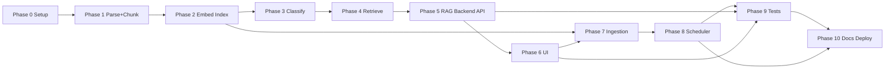
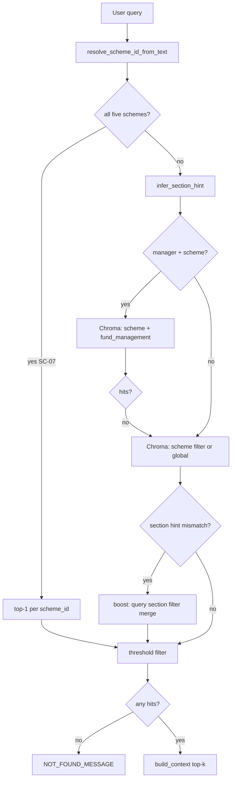
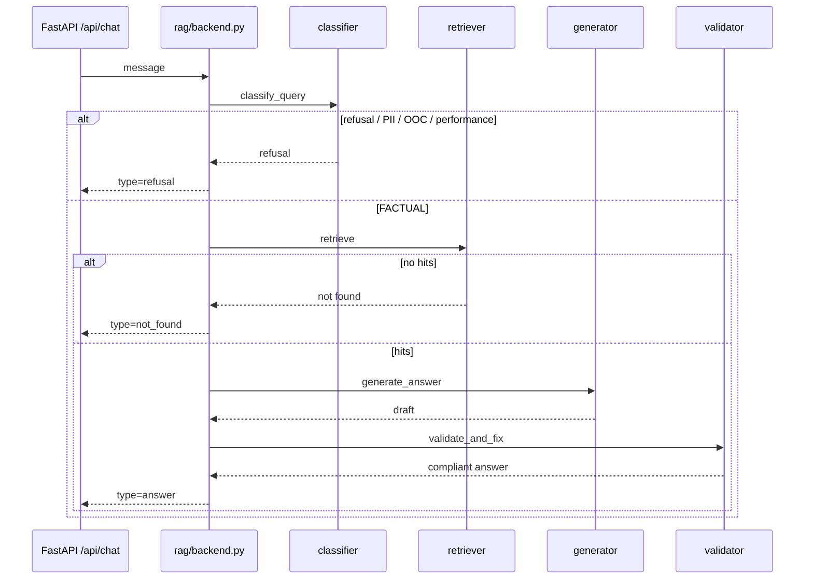

# Phase-Wise Implementation Plan

Execution roadmap for the **HDFC Mutual Fund FAQ Assistant** (facts-only RAG) in **eleven phases (Phase 0 → Phase 10)**. Each phase has tasks, edge-case checks, acceptance criteria, and an **exit gate**.

**References:** [problemStatement.md](./problemStatement.md) · [architecture.md](./architecture.md) · [edge-cases.md](./edge-cases.md)

**Stack:** Python 3.11+, FastAPI, Chroma, local BGE or OpenAI embeddings + **Groq** LLM chat, static/React UI, OS cron for daily ingestion.

---

## Overview — 11 phases (0–10)

| Phase | Name | Duration (indicative) | Depends on |
|-------|------|----------------------|------------|
| **0** | Project bootstrap & config | 1 day | — |
| **1** | Corpus parsing, sectioning & chunking | 2 days | Phase 0 |
| **2** | Embedding & vector index | 2 days | Phase 1 |
| **3** | Query classifier & compliance | 2 days | Phase 2 |
| **4** | Retriever & context assembly | 2 days | Phase 3 |
| **5** | RAG backend, generator, validator & API | 3 days | Phase 4 |
| **6** | Minimal chat UI | 2 days | Phase 5 |
| **7** | Daily ingestion pipeline | 2 days | Phase 2, 6 |
| **8** | Daily scheduler | 1 day | Phase 7 |
| **9** | Tests | 1 day | Phase 5, 6, 7 |
| **10** | Documentation & deployment | 1 day | Phase 8, 9 |



### How to use

1. Complete phases **0 → 1 → 2 → … → 10** in order (Phase 7 can start once Phase 2 index exists; Phases 5–6 needed before Phase 9–10 demo).
3. Run **edge-case checks** for that phase in [edge-cases.md](./edge-cases.md).
4. Pass the **exit gate** before the next phase.

### Corpus (all phases)

| `scheme_id` | Scheme |
|-------------|--------|
| `hdfc-silver-etf-fof` | HDFC Silver ETF FoF Direct Growth |
| `hdfc-mid-cap` | HDFC Mid Cap Fund Direct Growth |
| `hdfc-equity` | HDFC Equity Fund Direct Growth |
| `hdfc-gold-etf-fof` | HDFC Gold ETF Fund of Fund Direct Plan Growth |
| `hdfc-nifty-50-index` | HDFC NIFTY 50 Index Fund Direct Growth |

URLs: [problemStatement.md §1](./problemStatement.md#1-corpus-definition).

### Success criteria mapping

| Problem statement criterion | Phases |
|----------------------------|--------|
| Accurate retrieval (+ fund management) | 1 (chunk), 2, 4, 5, 7 |
| Facts-only / refusals | 3, 5 |
| Valid citations | 2, 5 |
| Minimal UI + disclaimer | 6 |
| Fresh corpus (daily job) | 7, 8 (pipeline + cron) |
| README + disclaimer | 10 |
| Deployable stack (VM/Docker) | 10 |

---

## Phase 0 — Project Bootstrap & Configuration

### Goal

Repository scaffold, environment template, and scheme registry (5 Groww URLs, aliases, compliance links).

### Prerequisites

None — **start here**.

### Tasks

| ID | Task | Output |
|----|------|--------|
| 0.1 | Initialize repo structure | `app/`, `ingestion/`, `data/`, `docs/`, `scripts/`, `tests/` |
| 0.2 | `requirements.txt` | FastAPI, Chroma, httpx, openai (or equivalent), pytest |
| 0.3 | `.env.example` + `.gitignore` | Ignore `vector_store/`, `.env` |
| 0.4 | `app/config.py` | Five `source_url`s, `scheme_id`s, alias map, AMFI/SEBI URLs |
| 0.5 | Scheme registry test | Assert 5 schemes + allowlisted URLs |

### Edge-case checks

[edge-cases.md § Phase 0](./edge-cases.md#phase-0--project-bootstrap): SE-06, SC-02–04, SC-11, PH0-01–03.

### Acceptance criteria

- [x] All 5 Groww URLs and `scheme_id`s in config
- [x] Alias map includes silver, gold FoF, mid cap, equity, nifty 50
- [x] No secrets in git
- [x] `pytest tests/test_config.py` (or smoke import config) passes

### Exit gate → Phase 1

Config module loads; scheme count = 5.

### Out of scope

Parsing, embeddings, API, UI.

---

## Phase 1 — Corpus Parsing, Sectioning & Chunking

### Goal

Turn Groww scheme pages into a **clean, sectioned corpus** (`data/corpus/`) and **chunk store** (`data/chunks/`) ready for Phase 2 embedding. Phase 1 defines both **section boundaries** (8 canonical keys) and **retrieval chunks** (~9 per scheme).

### Prerequisites

Phase 0 exit gate.

Network access for `scripts/fetch_raw.py`, or hand-placed imports in `uploads/` / `data/raw/`.

### Tasks

| ID | Task | Output |
|----|------|--------|
| 1.0 | `ingestion/fetch.py` + `scripts/fetch_raw.py` | `data/raw/{scheme_id}.{html,json,md}` from Groww |
| 1.1 | `ingestion/parse.py` | Strip nav/footer/calculator noise |
| 1.2 | Section mapper | `costs`, `exit_load`, `tax`, `minimum_investment`, `risk`, `benchmark`, `fund_management`, `objective` |
| 1.3 | `ingestion/load.py` | Read `uploads/*.md` or `data/raw/*.md` (uploads override raw) |
| 1.4 | `ingestion/corpus.py` + `scripts/build_corpus.py` | `data/corpus/{scheme_id}.{json,md,html}` |
| 1.5 | `ingestion/validate.py` + `scripts/validate_parse.py` | Log section counts per scheme |
| 1.6 | `ingestion/chunk.py` | Prefix template; per-section / per-manager split rules |
| 1.7 | `ingestion/chunk_store.py` + `scripts/build_chunks.py` | `data/chunks/{scheme_id}.{json,md}`, `all_chunks.json` |
| 1.8 | Chunk validation in `validate_parse.py` | Log chunk counts; RT-05 dedupe; IG-10 URL checks |

### Sectioning strategy (corpus shape)

One JSON object per scheme with fixed section keys. These keys drive chunk `section` metadata.

| Section ID | Source signal (headings / keywords) | Rules |
|------------|--------------------------------------|-------|
| `costs` | Expense ratio, TER, fund expenses | One block; strip calculator noise (IG-05) |
| `exit_load` | Exit load, redemption charge | **Single canonical block** (IG-06, RT-04) |
| `tax` | Tax, taxation, STCG/LTCG | One block |
| `minimum_investment` | Min SIP, min lumpsum | One block |
| `risk` | Riskometer, risk level | One block |
| `benchmark` | Benchmark index name | One block |
| `fund_management` | Fund manager(s), tenure, education, experience | Full section in corpus (FM-10) |
| `objective` | Investment objective | One block (short today) |

### Chunking strategy (Phase 1 — `data/chunks/`)

Chunk **from `data/corpus/*.json` sections**, not from raw HTML. Implemented in `ingestion/chunk.py` + `ingestion/chunk_store.py`.

| Section type | Chunking rule | Current corpus (~chars) |
|--------------|---------------|-------------------------|
| `costs`, `exit_load`, `tax`, `minimum_investment`, `risk`, `benchmark` | **1 chunk per section per scheme** | 26–174 each |
| `objective` | **1 chunk**; paragraph split only if &gt; ~2,400 chars, 300-char overlap | 113–160 |
| `fund_management` | **1 chunk per `Fund manager:` block** (tenure, education, experience, also manages together) | ~2,600–3,500 → **2 chunks**/scheme |
| **Prefix (all chunks)** | `Scheme: {scheme_name} \| Section: {section} \| {content}` | Required on every chunk |
| **Dedupe (RT-05)** | Drop identical `text` at chunk build | Before write to `data/chunks/` |
| **Do not** | Cross-scheme chunks; arbitrary token windows; re-split `exit_load` | Breaks citations |

**Expected budget:** ~**9 chunks/scheme** → **~45 chunks** total. See [architecture.md §5.3](./architecture.md#53-chunking-strategy).

**Artifacts per scheme**

| Location | Files | Role |
|----------|-------|------|
| `data/raw/` | `.html`, `.json`, `.md` | Fetch snapshot + parse input |
| `data/corpus/` | `.json`, `.md`, `.html` | Parsed sections |
| `data/chunks/` | `.json`, `.md`, plus `all_chunks.json` | Chunks for Phase 2 index |

### Edge-case checks

[edge-cases.md § Phase 1](./edge-cases.md#phase-1--parsing): IG-05–07, IG-12, RT-04, RT-05, FM-10, CI-06, PH1-01–04.

### Acceptance criteria

- [x] All 5 schemes produce parsed output (`data/corpus/*.json`)
- [x] `fund_management` section present on every scheme
- [x] Single canonical `exit_load` block per scheme
- [x] `Source URL` or filename maps to correct `scheme_id`
- [x] All 5 schemes produce chunks (`data/chunks/*.json`, `all_chunks.json`)
- [x] ~9 chunks/scheme; `fund_management` and `costs` chunks per scheme
- [x] Every chunk has allowlisted `source_url` and prefix template
- [x] `python scripts/validate_parse.py` exits 0 (sections + chunks)

### Exit gate → Phase 2

```powershell
python scripts/fetch_raw.py          # optional refresh
python scripts/build_corpus.py       # corpus + chunks
python scripts/validate_parse.py
python -m pytest tests/test_parse.py tests/test_corpus.py tests/test_fetch.py tests/test_chunk.py tests/test_phase1_gate.py -v
```

Parsed corpus and chunk store exist for **5 schemes**; ready for Phase 2 embed + index.

### Out of scope

Embeddings, vector store, LLM, Chroma upsert (Phase 2).

---

## Phase 2 — Embedding & Vector Index

### Goal

Load Phase 1 chunks from `data/chunks/`, embed with a configured provider, upsert to Chroma (`hdfc_groww_corpus`), smoke retrieval, basic ingestion tests.

### Prerequisites

Phase 1 exit gate.

`.env` from `.env.example` with embedding settings (see below). **`OPENAI_API_KEY` is not required** when using the default local BGE provider; it is required only for `EMBEDDING_PROVIDER=openai`. Phase 5 chat uses **Groq** (`GROQ_API_KEY`); without it, template generation is used.

`pip install -r requirements.txt` (includes `sentence-transformers` for local BGE, **ChromaDB 1.x** — prebuilt Windows wheels; no C++ build tools).

### Embedding model choice

Implemented in `ingestion/embed.py` and `app/config.py`. Phase 4 retriever must use the **same provider and model** as indexing (`embed_query` for questions, `embed_texts` for chunks).

| Provider | `EMBEDDING_PROVIDER` | Model | Cost | When to use |
|----------|----------------------|-------|------|-------------|
| **Local BGE (default)** | `local` | `BAAI/bge-small-en-v1.5` | Free, runs offline | **This corpus** — 45 chunks, max ~2.3k chars/chunk; fast index build |
| **Local BGE large** | `local` | `BAAI/bge-large-en-v1.5` | Free, more RAM/CPU | Very long passages (&gt;4k chars) or indexes with 500+ chunks |
| **OpenAI** | `openai` | `text-embedding-3-small` (or `-large`) | Paid API | Cloud-only deploy; no local GPU/RAM for models |

**Auto-pick (local only):** `EMBEDDING_AUTO_BGE=true` selects small vs large from chunk stats via `recommend_bge_model()` (current data → **small**). Set `EMBEDDING_AUTO_BGE=false` and pin `EMBEDDING_MODEL` to override.

**Example `.env` (recommended for fellowship demo):**

```env
EMBEDDING_PROVIDER=local
EMBEDDING_MODEL=BAAI/bge-small-en-v1.5
EMBEDDING_AUTO_BGE=true
VECTOR_STORE_PATH=vector_store
```

**Rules**

| Rule | Detail |
|------|--------|
| Passages at index | `embed_texts()` — chunk `text` from `data/chunks/`; no BGE query prefix |
| Queries at retrieval (Phase 4) | `embed_query()` — adds BGE query prefix when provider is `local` |
| Model switch | Rebuild index if you change model (small=384-dim, large=1024-dim, OpenAI=1536-dim) |
| Similarity threshold | BGE cosine scores differ from OpenAI; tune `SIMILARITY_THRESHOLD` in Phase 4 (~0.5–0.65 typical for BGE) |

See [architecture.md §5.4](./architecture.md#54-embedding--index).

### Vector store choice (ChromaDB)

**Use ChromaDB** — not FAISS — for this project.

| Factor | This corpus | ChromaDB | FAISS |
|--------|-------------|----------|-------|
| Scale | **45 chunks**, 5 schemes | More than enough | Optimized for millions of vectors |
| Metadata | `scheme_id`, `section`, `source_url`, `ingested_at` | Native `where` filters + upsert by `chunk_id` | Vectors only; metadata is DIY |
| Daily ingest | Upsert + keep `ingested_at` | Built-in | Rebuild or custom ID maps |
| Phase 4 retriever | Scheme filter + section boost | Fits plan | Extra application code |

FAISS only makes sense at much larger scale or when you do not need per-chunk metadata filtering. **Collection:** `hdfc_groww_corpus` · **Path:** `vector_store/` (gitignored).

### Tasks

| ID | Task | Output |
|----|------|--------|
| 2.0 | `ingestion/embed.py` + config | `EMBEDDING_PROVIDER`, `EMBEDDING_MODEL`, `EMBEDDING_AUTO_BGE`; `embed_texts` / `embed_query` |
| 2.1 | `ingestion/index.py` | Load `data/chunks/`; embed; Chroma upsert + `query_chunks()` |
| 2.2 | `scripts/build_index.py` | `vector_store/` populated with chosen model |
| 2.3 | `scripts/smoke_retrieve.py` | CLI retrieval smoke (mid cap expense, gold exit load, nifty manager) |
| 2.4 | `tests/test_ingestion.py` + `tests/test_embed.py` + `tests/test_phase2_gate.py` | Index smoke; provider routing and BGE recommend tests |

### Edge-case checks

[edge-cases.md § Phase 2](./edge-cases.md#phase-2--index): IG-10 (re-check at index), PH2-01–04, PH2-09.

### Acceptance criteria

- [x] Embedding provider and model documented in `.env.example`
- [x] Vector store: ChromaDB (`hdfc_groww_corpus`) documented above
- [x] Default local BGE-small indexes all 45 chunks without `OPENAI_API_KEY`
- [x] Every indexed chunk has valid `source_url` (from Phase 1 store)
- [x] `ingested_at` / `last_updated` set on upsert
- [x] Smoke: expense ratio (mid cap), exit load (gold), manager (nifty) retrieve correct `scheme_id`
- [x] `test_ingestion.py`, `test_embed.py`, and `test_phase2_gate.py` pass

### Exit gate → Phase 3

```powershell
pip install -r requirements.txt
copy .env.example .env   # EMBEDDING_PROVIDER=local, BGE-small default
python scripts/build_index.py --reset
python scripts/smoke_retrieve.py
python -m pytest tests/test_embed.py tests/test_ingestion.py tests/test_phase2_gate.py -v
```

Vector store queryable with the configured embedding model; smoke retrieval above similarity threshold.

### Out of scope

Chat API, classifier, UI, live fetch, re-chunking (done in Phase 1).

---

## Phase 3 — Query Classifier & Compliance

### Goal

`app/rag/classifier.py` + refusal templates: advisory, performance, PII, out-of-corpus — **before** retrieval cost.

### Prerequisites

Phase 2 exit gate.

### Tasks

| ID | Task | Output |
|----|------|--------|
| 3.1 | `classifier.py` | Classes: `ADVISORY`, `PERFORMANCE_COMPARE`, `PII`, `OUT_OF_CORPUS`, `FACTUAL` |
| 3.2 | Rule-based keywords | Hybrid optional LLM fallback for ambiguous |
| 3.3 | Refusal templates | AMFI/SEBI links from config |
| 3.4 | PII patterns | PAN, phone, email, Aadhaar, account, OTP |
| 3.5 | `tests/test_classifier.py` | CL-* and MX-* refusal cases |

### Edge-case checks

[edge-cases.md § Phase 3](./edge-cases.md#phase-3--classifier): CL-01–CL-22, MX-01–MX-10, SE-04 (stub).

### Acceptance criteria

- [x] Advisory / comparison / manager-opinion → refusal (no RAG call in test harness)
- [x] PII → hard refuse
- [x] SBI / Flexi Cap → `OUT_OF_CORPUS` + five schemes list
- [x] “benchmark” query does not false-positive on “better” (CL-20)
- [x] `test_classifier.py` passes

### Exit gate → Phase 4

```powershell
python -m pytest tests/test_classifier.py -v
```

### Out of scope

Retriever, generator, HTTP routes (except test harness).

---

## Phase 4 — Retriever & Context Assembly

### Goal

`app/rag/retriever.py`: embed query (`embed_query`), scheme filter, section-aware search, provider-calibrated thresholds, `[CONTEXT]` assembly, not-found template. Low-level Chroma search stays in `ingestion.index.query_chunks` (extended with optional `section` filter).

### Prerequisites

Phase 3 exit gate. Built Chroma index at `VECTOR_STORE_PATH` (default `vector_store/`).

### Retrieval strategy (Phase 4)

Runs **after** classifier returns `FACTUAL`.



| Step | Rule |
|------|------|
| Embed | `embed_query()` — same provider/model as index; BGE query prefix when `local` |
| Scheme (4.2) | `resolve_scheme_id_from_text()` → Chroma `where scheme_id` (SC-01, SC-08, SC-12) |
| All-scheme (SC-07) | Phrases like “all five schemes” → **one hit per scheme** (`minimum_investment`, etc.) |
| Section hint | Keywords → `costs`, `exit_load`, `tax`, `minimum_investment`, `risk`, `benchmark`, `fund_management` |
| Manager boost (4.3, RT-03) | If hint is `fund_management` **and** scheme known → search `section=fund_management` first (max 2 chunks); else fallback to scheme-wide `top_k` |
| Section merge | If top hit section ≠ hint → extra query with `section` filter; merge by rank (RT-10 multi-section via `top_k=5`) |
| `top_k` | **5** (config `TOP_K`) |
| Threshold (4.1) | **Provider-aware** — not a flat 0.7 for BGE (see table below) |
| Not-found (4.5, RT-01) | Empty after threshold → `NOT_FOUND_MESSAGE`; no generator call |
| Context (4.4) | `[CONTEXT]` blocks with `content` (prefix stripped), `source_url`, `last_updated` |
| Citation pick | Highest-similarity chunk `source_url` on `RetrievalResult` |

**Similarity thresholds (empirical on 45-chunk BGE-small index)**

| Provider | Scheme filter | No scheme filter |
|----------|---------------|------------------|
| `local` (BGE) | **0.60** | **0.55** |
| `openai` | `SIMILARITY_THRESHOLD` (default **0.7**) | same |

Override per call via `retrieve(..., min_similarity=...)`. Env `SIMILARITY_THRESHOLD` applies to OpenAI only; local BGE uses the table unless overridden.

**Generic / ambiguous queries (SC-05):** no scheme filter → global `top_k`; Phase 5 may ask user to specify fund. **Wrong scheme (SC-08):** always filter when alias/URL/name resolves.

### Tasks

| ID | Task | Output |
|----|------|--------|
| 4.1 | `retriever.py` + `effective_min_similarity()` | `top_k=5`; BGE 0.60/0.55; OpenAI 0.7 |
| 4.2 | Scheme resolution | `resolve_scheme_id_from_text` → Chroma filter |
| 4.3 | Section boost | `fund_management` pre-filter; hint merge for other sections |
| 4.4 | Context builder | `build_context()` → `[CONTEXT]` for LLM |
| 4.5 | Not-found path | `NOT_FOUND_MESSAGE` when no chunk above threshold |
| 4.6 | `tests/test_retriever.py` | SC-*, RT-* factual retrieval cases |
| 4.7 | `query_chunks(section=...)` | `build_chroma_where` in `ingestion/index.py` |

### Edge-case checks

[edge-cases.md § Phase 4](./edge-cases.md#phase-4--retriever): SC-01, SC-05–12, IN-06–10, IN-14, RT-01–03, RT-06–07, RT-10, PH2-09.

### Acceptance criteria

- [x] Scheme filter narrows to correct fund when named
- [x] Manager query retrieves `fund_management` chunks
- [x] Below threshold → not-found (no hallucination path yet)
- [x] `test_retriever.py` passes

### Exit gate → Phase 5

```powershell
python -m pytest tests/test_retriever.py -v
```

Retriever returns relevant chunks for 5+ golden queries (no LLM required).

### Out of scope

Generator, validator, `/api/chat`, UI.

---

## Phase 5 — RAG Backend, Generator, Validator & Chat API

### Goal

**RAG backend** (`app/rag/backend.py`) orchestrates the full pipeline; **FastAPI** exposes it at `/api/chat`, `/api/health`, `/api/schemes`. Generator + validator enforce facts-only answers (≤3 sentences, one Groww link, footer).

### Prerequisites

Phase 4 exit gate. Chroma index at `VECTOR_STORE_PATH` (default `vector_store/`).

`GROQ_API_KEY` optional: without it, **template generation** from retrieved chunks (tests/CI); with key, Groq chat (`CHAT_MODEL`, default `llama-3.3-70b-versatile`). `OPENAI_API_KEY` remains optional for paid OpenAI embeddings only.

### RAG backend (orchestrator)

Single entry: `run_rag(message) -> RagBackendResponse`.



| Step | Module | Behavior |
|------|--------|----------|
| 1 | `classifier.py` | PII → out-of-corpus → performance → advisory → factual |
| 2 | `retriever.py` | Phase 4 retrieval + `[CONTEXT]` |
| 3 | `generator.py` | Groq or **template** from top chunk |
| 4 | `validator.py` | ≤3 sentences, allowlisted URL, footer, no advisory leakage |
| 5 | `backend.py` | On validation failure → template retry; index missing → 503 |

**API response shape:** `{ "answer", "citation_url", "footer", "type" }` where `type` is `answer` \| `refusal` \| `not_found` \| `error`.

**Logging (5.7):** `redact_pii()` on query text before log (SE-04).

### Tasks

| ID | Task | Output |
|----|------|--------|
| 5.0 | `backend.py` | `run_rag()`, `RagBackendResponse`, `ResponseType` |
| 5.1 | `generator.py` | Groq chat; ≤3 sentences; one markdown link; footer; template fallback |
| 5.2 | `validator.py` | Sentences, allowlisted URL, footer, advisory leakage |
| 5.3 | Wire pipeline in backend | classifier → retriever → generator → validator |
| 5.4 | `app/main.py` + `app/api/routes.py` | FastAPI app + `POST /api/chat` |
| 5.5 | `/api/health` | `ingested_at`, corpus version, `index_ready` |
| 5.6 | `/api/schemes` | List 5 schemes + URLs |
| 5.7 | Logging | PII redaction in routes/backend |
| 5.8 | `tests/test_golden.py` | Backend + API + validator core cases |

### Run API

```env
# .env — optional for LLM answers (template works without key)
GROQ_API_KEY=gsk_...
CHAT_MODEL=llama-3.3-70b-versatile
```

```powershell
pip install -r requirements.txt
python scripts/build_index.py --reset   # if needed
uvicorn app.main:app --reload --port 8000
```

```powershell
curl -X POST http://localhost:8000/api/chat -H "Content-Type: application/json" -d "{\"message\": \"What is the exit load on HDFC Gold ETF Fund of Fund?\"}"
python scripts/smoke_chat.py --template
```

### Edge-case checks

[edge-cases.md § Phase 5](./edge-cases.md#phase-5--generator--api): GN-01–GN-15, FM-01–FM-09, CI-01–04, AP-01–03, AP-07, AP-09, IN-02–05, IN-12.

### Acceptance criteria

- [x] Mid Cap expense ratio → fact + citation + footer
- [x] NIFTY 50 manager → biographical only (template/LLM from FM chunks)
- [x] Validator blocks 4+ sentences and non-allowlisted URLs
- [x] `/api/health` reflects index metadata
- [x] Core `test_golden.py` cases pass via TestClient

### Manual smoke

| Query | Expected `type` |
|-------|-----------------|
| Exit load on Gold ETF FoF? | `answer` |
| Min SIP for silver fund? | `answer` |
| Which fund is better? | `refusal` |
| Compare 3Y returns | `refusal` |

### Exit gate → Phase 6

```powershell
uvicorn app.main:app --port 8000
python -m pytest tests/test_golden.py tests/test_retriever.py tests/test_classifier.py -v
```

API-only demo works (curl/Postman); core edge-case IDs verified.

### Out of scope

UI, `fetch.py`, cron.

---

## Phase 6 — Minimal Chat UI

### Goal

Chat interface per problem statement: welcome, 3 example chips, disclaimer, citations, refusal styling.

### Prerequisites

Phase 5 exit gate.

### Tasks

| ID | Task | Output |
|----|------|--------|
| 6.1 | `ui/` scaffold | React+Vite or static HTML/CSS |
| 6.2 | Chat + `POST /api/chat` | Loading, errors, answer + link + footer |
| 6.3 | Welcome copy | Facts-only; 5 HDFC schemes |
| 6.4 | Three example chips | Mid Cap expense; Gold exit load; NIFTY 50 manager |
| 6.5 | Sticky disclaimer | “Facts-only. No investment advice.” |
| 6.6 | CORS | UI origin on API |
| 6.7 | Refusal + XSS | Distinct `type: refusal`; escape HTML (UI-07) |

### Edge-case checks

[edge-cases.md § Phase 6](./edge-cases.md#phase-6--chat-ui): UI-01–UI-09, IN-01, IN-11, IN-13, AP-10, PH6-01–03.

### Acceptance criteria

- [x] E2E factual question <10s p95 local
- [x] Disclaimer always visible; chips work
- [x] Citation opens Groww in new tab (`rel="noopener noreferrer"`)
- [x] Advisory question shows refusal styling
- [x] Empty input blocked in UI

### Exit gate → Phase 7

UI → API → index demo without manual curl.

### Out of scope

`run_daily.py`, cron, production hardening.

---

## Phase 7 — Daily Ingestion Pipeline

### Goal

End-to-end **daily** job: fetch → parse → chunk → index with lock file, failure policy (keep previous index), atomic swap, and health observability.

### Prerequisites

Phase 2 index pipeline (parse/chunk/index from Phases 1–2). Phase 6 UI optional until Phase 10 demo.

### Tasks

| ID | Task | Output |
|----|------|--------|
| 7.1 | `ingestion/fetch.py` (production) | 5 URLs → `data/raw/`; backoff; rate limit between URLs |
| 7.2 | `ingestion/run_daily.py` | fetch → parse → chunk → index; lock file |
| 7.3 | Failure policy | Keep previous index on failure |
| 7.4 | Atomic index swap | Temp → swap (SK-03) |
| 7.5 | Observability | `ingesting` on `/api/health`; ingest metrics/logs |
| 7.6 | `admin/reindex` (dev) | Optional protected endpoint |

### Edge-case checks

[edge-cases.md § Phase 7](./edge-cases.md#phase-7--daily-ingestion-pipeline): IG-01–04, IG-08–09, IG-11, IG-13, SK-01–SK-04, SK-02, RT-08, AP-06, CI-05, CI-07, FM-05, PH7-01, PH7-03, PH7-04.

### Acceptance criteria

- [x] `run_daily.py` succeeds; re-run updates `ingested_at`
- [x] Failed ingest does not wipe index; health warns when appropriate
- [x] Partial fetch (e.g. 3/5) fails job; old index retained
- [x] `test_phase7_daily.py` covers lock + atomic swap smoke

### Exit gate → Phase 8

```powershell
python -m ingestion.run_daily --skip-fetch
python -m pytest tests/test_phase7_daily.py -v
```

### Out of scope

OS cron wiring, full golden suite, prod security, final README.

---

## Phase 8 — Daily Scheduler

### Goal

Wire **external** daily cron (or K8s CronJob / GitHub Actions) to invoke the Phase 7 ingestion entrypoint (`scripts/reindex.sh` → `ingestion/run_daily.py`). Document schedule and timezone in repo.

### Prerequisites

Phase 7 exit gate (`run_daily.py` succeeds end-to-end).

### Tasks

| ID | Task | Output |
|----|------|--------|
| 8.1 | `scripts/reindex.sh` | Cron-safe wrapper (venv, cwd, logging) |
| 8.2 | `scheduler/cron.example` | Sample crontab / K8s CronJob; `INGEST_CRON_SCHEDULE`, `INGEST_TIMEZONE` |
| 8.3 | Wire daily cron | OS cron / K8s / GitHub Actions `schedule` |
| 8.4 | Scheduler docs | README section stub → completed in Phase 10 |

### Edge-case checks

[edge-cases.md § Phase 8](./edge-cases.md#phase-8--daily-scheduler): SK-05–SK-08, SK-07, PH7-05, PH7-06.

### Acceptance criteria

- [x] `reindex.sh` invokes `run_daily.py` with project root and `.env`
- [x] `scheduler/cron.example` matches `INGEST_CRON_SCHEDULE` / `INGEST_TIMEZONE` in `.env.example` (10:00 AM IST)
- [x] Cron documented (host TZ vs `INGEST_TIMEZONE`) — `scheduler/README.md`
- [x] Overlapping runs prevented via Phase 7 lock file + `flock` in `reindex.sh` (SK-01, PH7-05)

### Exit gate → Phase 9

```powershell
# Manual smoke (scheduler path)
bash scripts/reindex.sh
# or: python -m ingestion.run_daily
```

Cron entrypoint runs once without error when Phase 7 pipeline is green.

### Out of scope

`run_daily.py` implementation, golden tests, prod rate limits, deployment docs.

---

## Phase 9 — Tests

### Goal

Full golden / edge-case test coverage and production API hardening (rate limits, CORS, admin lockdown) before handoff.

### Prerequisites

Phase 5 API, Phase 6 UI, Phase 7 `run_daily.py` green. Phase 8 optional for scheduler smoke tests.

### Tasks

| ID | Task | Output |
|----|------|--------|
| 9.1 | Expand `test_golden.py` + `test_ingestion.py` | Full edge-case coverage (RT-09, PH7-02) |
| 9.2 | Security | Rate limit, prod CORS, disable open admin |
| 9.3 | CI smoke | `pytest` in GitHub Actions or local gate script |

### Edge-case checks

[edge-cases.md § Phase 9](./edge-cases.md#phase-9--tests): RT-09, AP-04, AP-08, SE-01–02, SE-05, PH7-02.

### Acceptance criteria

- [x] Full `pytest` green
- [x] Rate limit on `/api/chat` in prod config
- [x] Open `admin/reindex` disabled or protected in prod

### Exit gate → Phase 10

```powershell
python -m pytest -v
```

### Out of scope

README, Docker/VM deploy guide, final demo runbook.

---

## Phase 10 — Documentation & Deployment

### Goal

Ship **documentation** and a **repeatable deployment** path (local VM or container): setup, env, cron, API + UI, disclaimer, fellowship demo checklist.

### Prerequisites

Phase 8 scheduler documented, Phase 9 tests green, Phases 5–6 demo-ready.

### Tasks

| ID | Task | Output |
|----|------|--------|
| 10.1 | `README.md` | Setup, 5 scheme URLs, `.env`, build index, run API/UI, cron |
| 10.2 | Disclaimer & limitations | Facts-only; no advice; corpus refresh cadence |
| 10.3 | Deployment guide | `docs/deployment.md` or README § Deploy: uvicorn, `vector_store/`, cron on host |
| 10.4 | Optional container | `Dockerfile` + `docker-compose.yml` (API + volume for Chroma) |
| 10.5 | Prod env template | `.env.production.example` (no secrets); CORS origins, rate limits |
| 10.6 | Final demo checklist | Below |

### Edge-case checks

[edge-cases.md § Phase 10](./edge-cases.md#phase-10--documentation--deployment): AP-05, PH7-06, PH10-*.

### Acceptance criteria

- [ ] README documents daily ingest (Phase 7) and cron scheduler (Phase 8)
- [ ] New developer can run API + UI from README alone
- [ ] Deployment path documented (bare metal or Docker)
- [ ] Final demo checklist complete

### Final demo checklist

| # | Action |
|---|--------|
| 1 | One factual question per scheme (5) |
| 2 | Fund manager question for ≥2 schemes |
| 3 | Advisory refusal + AMFI/SEBI |
| 4 | UI disclaimer + 3 chips |
| 5 | Answer ≤3 sentences, 1 link, footer |
| 6 | Cron documented (Phase 8) |

### Exit gate → Project complete

All items in **Project completion checklist** below.

```powershell
# Fresh-machine smoke (follow README deploy section)
uvicorn app.main:app --port 8000
```

---

## Project completion checklist

| Deliverable | Phase |
|-------------|-------|
| Config + 5 schemes | 0 |
| Parsed corpus + chunk store | 1 |
| Chroma vector index (BGE-small) | 2 |
| Classifier + refusals | 3 |
| Retriever | 4 ✓ |
| RAG backend + `/api/chat` + validator | 5 ✓ |
| Chat UI + disclaimer | 6 ✓ |
| `run_daily.py` + atomic ingest | 7 |
| Daily scheduler + `reindex.sh` | 8 |
| Golden tests + prod hardening | 9 |
| README + deployment guide | 10 |
| Final demo / handoff | 10 |

---

## Cross-phase dependencies

| Rule | Detail |
|------|--------|
| Linear core | 0 → 1 → 2 → 3 → 4 → 5 → 6 |
| Post-UI ops | **7 → 8 → 9 → 10** (ingest → cron → tests → docs/deploy) |
| Phase 7 ingest | Needs parse/chunk/index from 1–2; can develop `run_daily` after Phase 2 |
| Phase 8 scheduler | Needs Phase 7 `run_daily.py` entrypoint |
| Phase 9 tests | Needs Phase 5 API + Phase 6 UI; Phase 7 for ingestion tests |
| Phase 10 deploy | Needs Phase 8 cron docs + Phase 9 green tests |
| Do not skip Phase 3 | Compliance before retrieval saves cost and risk |

---

## Risks (by phase)

| Risk | Phases | Mitigation |
|------|--------|------------|
| Groww HTML changes | 1, 7 | Resilient parser; import fallback |
| Empty index | 2 | Exit gate; ingestion tests |
| Advisory leakage | 3, 5 | Classifier + validator |
| Hallucination | 5 | Context-only; validator |
| Wrong scheme | 0, 4 | Aliases + filter |
| Scheduler overlap | 7, 8 | Lock file (`run_daily`) |
| Ingest during traffic | 7 | Atomic swap; old index until done |

---

## References

- [edge-cases.md](./edge-cases.md) — 11-phase edge-case catalog (Phase 0–10)
- [architecture.md](./architecture.md) — technical design
- [problemStatement.md](./problemStatement.md) — product rules
